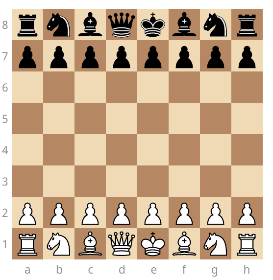

# Домашнее задание №1: Шахматная доска

Домашнее задание проводится в рамках курса НИС "Кроссплатформенные и облачные веб-приложения" по теме: **"Введение в веб-разработку. HTML, CSS"**

## Формулировка

В рамках данного задания вам необходимо создать верстку стандартной шахматной доски с шахматными фигурами на стартовых позициях, используя только HTML и CSS как инструмент.

Пример проделанной работы:



Параметры фрагментов доски и фигур:

- Размер шахматной клетки: 30х30 пикселей

### Обязательные требования к работе

Итоговая работа включает в себя:

- Файл index.html, содержащий верстку страницы
- Файл style.css, содержащий стили к HTML-странице

Фигуры располагаются на своих клетках в начале партии точно по центру в своей клетке

### Дополнительное задание

- На итоговой работе присутствует система координат, где по оси абсцисс отображены буквы латинского алфавита, а по оси ординат - цифры. Начало координат ведется от белой левой ладьи;
- Шахматные клетки имеют отличные от черного и белого цвета;
- Фигуры используются в верстке как изображения, а не символы; изображения с фигурами можно как скачать и сохранить в папке с работой, так и сослаться в HTML-файле на сторонний ресурс (на ваше усмотрение);
- Задан заголовок вкладки, отличный от `Document` или другого стандартного названия

Также приветствуется следующая организация файлов в работе:

```fs
├── chessboard
│   ├── assets
│   │   ├── <файлы_изображений>
│   ├── css
│   │   ├── <файлы_стилей>.css
│   ├── index.html
```

Кроме того, вы можете не ограничиваться теми свойствами стилей, которые были продемонстрированы на семинаре. Любое визуальное улучшение может быть оценено дополнительно.

## Сдача работы

Для передачи работы на проверку необходимо создать собственную ветку от `main` с названием `<Фамилия>_<Первая_буква_имени>_<номер_дз>` латиницей, в которой будут содержаться коммиты работы. Последний коммит будет использован для проверки домашнего задания.

## Дедлайн

Крайний срок сдачи этого домашнего задания: 17 сентября 2023, 23:59:59. Каждый следующий день после дедлайна наказывается штрафом в 10% от оценки за работу вплоть до 50%.

### Комментарий преподавателя

Все оценки будут введены в таблицу оценок по мере проверки работ.

Просьба по необходимости использовать [MDN](https://developer.mozilla.org) в качестве справочного материала.
