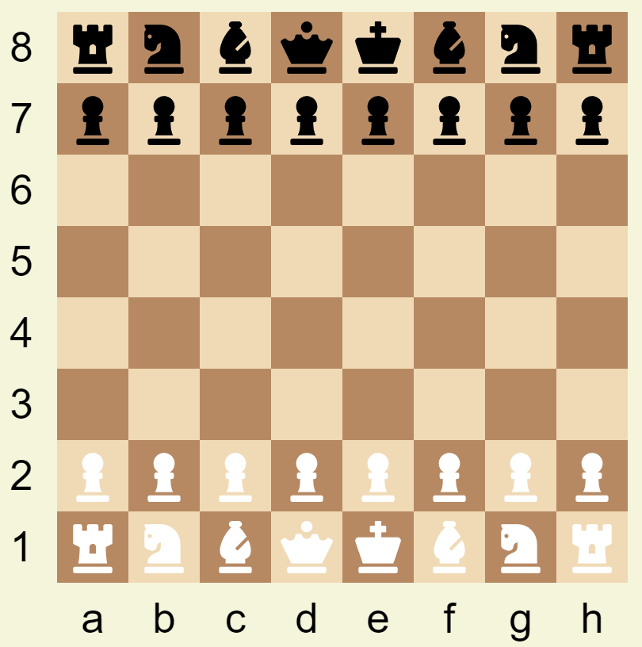

# Домашнее задание №1: Шахматная доска

Домашнее задание проводится в рамках курса НИС "Кроссплатформенные и облачные веб-приложения" по теме: **"Введение в веб-разработку. HTML, CSS"**

### Исполнитель: Миронов Павел
### Группа: БПИ-212
## Отчёт

Результат проделанной работы



Все критерии, включая дополнительные, выполнены.

Структура файлов:

```fs
├── chessboard
│   ├── assets
│   │   ├── chess
│   │   │   ├── <файлы_шахматных_фигур>.svg
│   │   ├── preview.png // скриншот работы
│   ├── css
│   │   ├── chessboard.css // стили для шахматной доски
│   │   ├── global.css // глобальные стили
│   ├── index.html // html-разметка
```