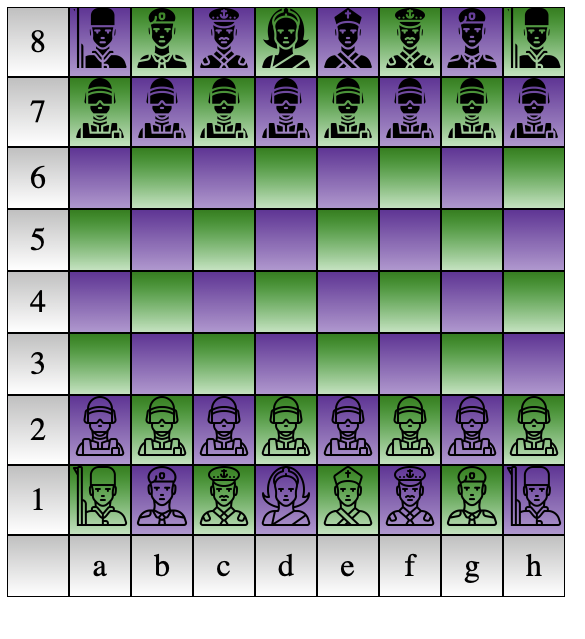

# Домашнее задание №1: Шахматная доска

Домашнее задание проводится в рамках курса НИС "Кроссплатформенные и облачные веб-приложения" по теме: **"Введение в веб-разработку. HTML, CSS"**

## Пример выполненной работы

Выполнены все пункты основного и дополнительного задания.
Парахин Николай, БПИ 212
